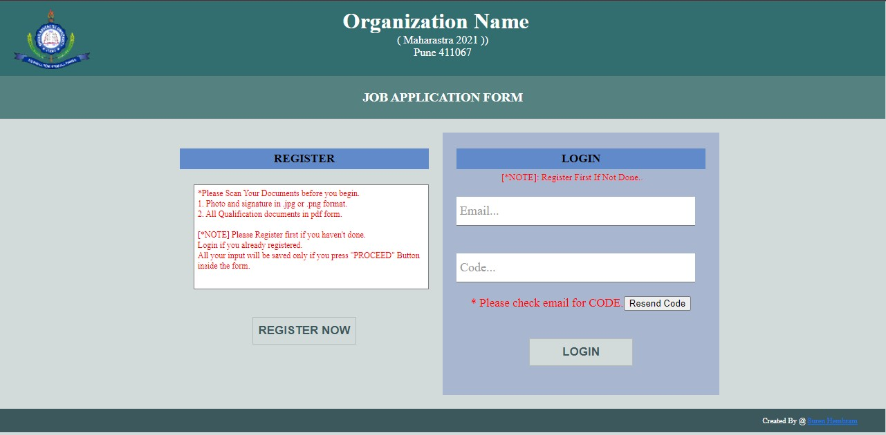
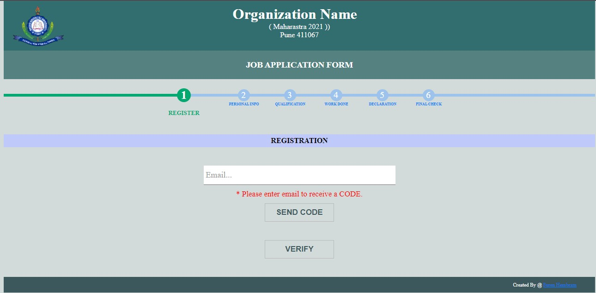
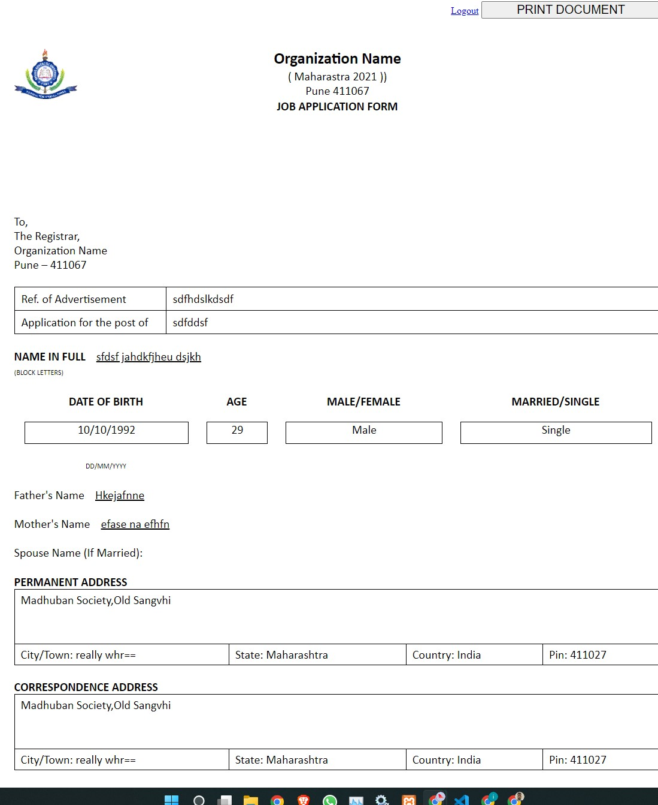

# **Carrer form**

**ALL SETTINGS REQUIRED TO CHANGE IS IN "include/config.php"**

Thigs required to change:

```php
 1. $dbhost="localhost"; //hostname
 2. $dbuser="<your-database-username>";  //mysql acc/ username
 3. $dbpass="<your-databse-password>";  //mysql scc/ password
 4. $dbname="<your-database-name>"; //mysql database name
 5. $adminemail="<your-admin-mail>";
```

## **Screen shots**

<br>
<br>
<br>

